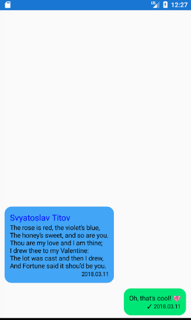
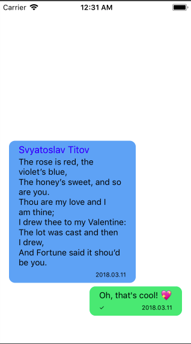

# Xamarin Forms - ChatView

ChatView decides some things when working with chat such as reverse stack, long click on the cell, update the view.

## Images



## Getting Started

Install ChatView to core, android, ios projects.

Add namespace to page
```xml
xmlns:chatview="clr-namespace:ChatView.Shared;assembly=ChatView.Shared"
```
And use

```xml
<chatview:MessageListView 
    ItemsSource="{Binding List}"
    VerticalOptions="FillAndExpand"
    HorizontalOptions="FillAndExpand">
    <chatview:MessageListView.ItemTemplate>
        <DataTemplate>
            <chatview:MessageCell 
                TextFontSize="14"
                InfoFontSize="10"
                NameFontSize="16"
                CornerRadius="16"
                IncomingColor="#827717"
                OutgoingColor="#689F38"
                TextFontColor="#4E342E"
                NameFontColor="#FF3D00"
                InfoFontColor="#607D8B"
                MessageBody="{Binding Message}"
                Date="{Binding Date}"
                IsIncoming="{Binding IsIncoming}"
                Name="{Binding Name}"
                Status="{Binding Status}"/>
        </DataTemplate>
    </chatview:MessageListView.ItemTemplate>
</chatview:MessageListView>
```

Add `MessageListViewRenderer.Initialize();` into `MainActivity` - `OnCreate` 

Add `MessageListViewRenderer.Initialize();` into `AppDelegate` - `FinishedLaunching`

## API Reference

|Property | Description |
|---------|-------------|
|`TextFontSize`| Size for messages text|
|`InfoFontSize`| Size for date and status text|
|`NameFontSize`| Size for name text|
|`CornerRadius`| The property for smoothing the corners of the message frame|
|`IncomingColor`| Color of incoming message|
|`OutgoingColor`| Color of outgoing message|
|`TextFontColor`| Color of messages text|
|`NameFontColor`| Color of name text|
|`InfoFontColor`| Color of date and status text|

### Events

|Name| Description|
|---------|-------------|
|`OnLongClick`| Handle long click on cell. Returns model as object.  |

## NuGet

https://www.nuget.org/packages/ChatView/0.9.1

## License

This project is licensed under the MIT License - see the [LICENSE](LICENSE) file for details
